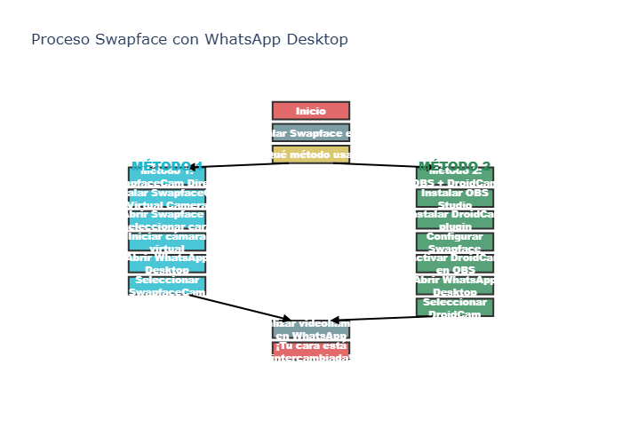

# Swapface + WhatsApp — Guía y Scripts

[](https://www.python.org/)
[](LICENSE)
[](https://github.com/Joseluiscruz-hub/Swapface-WhatsApp)

Proyecto que genera tablas comparativas, requisitos del sistema y diagramas de flujo para usar Swapface con WhatsApp Desktop.

## 📊 Preview



---

---

## 📁 Archivos principales

- `script.py` — Crea `comparacion_metodos_swapface_whatsapp.csv` (usa pandas)
- `script_1.py` — Crea `requisitos_sistema_swapface.csv` (usa pandas)
- `chart_script.py` — Crea `swapface_flowchart.png` y `swapface_flowchart.svg` (usa plotly + kaleido)
- `requirements.txt` — Dependencias (pandas, plotly, kaleido) con versiones fijadas
- `run_all.py` — Ejecuta los tres scripts en orden (comprobando dependencias)

## ⚙️ Requisitos previos

- Python 3.8+ (recomendado 3.11)
- Windows (instrucciones aquí para cmd.exe / PowerShell)

## 🚀 Instalación y uso (cmd.exe)

**1. Abrir una ventana de cmd y situarse en la carpeta del proyecto:**

```cmd
cd /d "C:\Users\XxGol\Downloads\exported-assets"
```

**2. Crear y activar un entorno virtual (recomendado):**

```cmd
python -m venv .venv
.venv\Scripts\activate
```

**3. Instalar dependencias:**

```cmd
python -m pip install --upgrade pip
python -m pip install -r requirements.txt
```

**4. Ejecutar todo (genera CSVs y diagramas):**

```cmd
python run_all.py
```

**5. Verificar archivos generados:**

```cmd
dir /b
start comparacion_metodos_swapface_whatsapp.csv
start swapface_flowchart.png
```

## 💻 Instalación y uso (PowerShell)

```powershell
cd "C:\Users\XxGol\Downloads\exported-assets"
python -m venv .venv
.\.venv\Scripts\Activate.ps1
python -m pip install --upgrade pip
python -m pip install -r requirements.txt
python run_all.py
```

## 📝 Notas importantes

- `chart_script.py` utiliza Plotly y `kaleido` para exportar imágenes. Asegúrate de instalar `kaleido` en el mismo entorno virtual donde ejecutas los scripts.
- Si ves errores de "ModuleNotFoundError", activa el venv correcto o instala las dependencias con `python -m pip install -r requirements.txt`.

## 📄 Licencia

Este proyecto está bajo la licencia MIT. Consulta el archivo [LICENSE](LICENSE) para más detalles.

---

**Desarrollado por** [Joseluiscruz-hub](https://github.com/Joseluiscruz-hub)
